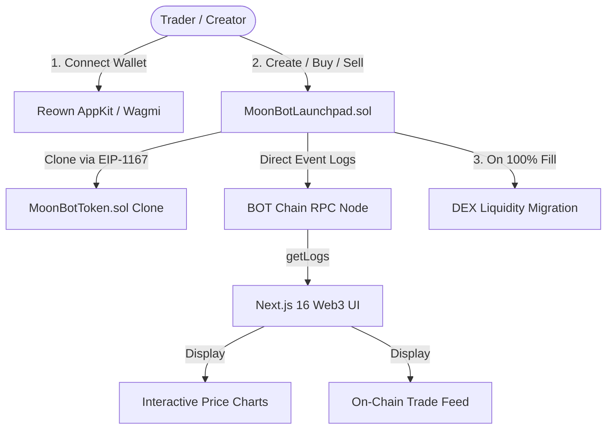

# 🌕 MoonBot Protocol Whitepaper
**A Fair-Launch Autonomous Bonding Curve Protocol on BOT Chain**

**Version:** 1.0  
**Network:** BOT Chain Testnet (`Chain ID: 968`) & BOT Chain Mainnet (`Chain ID: 677`)  
**Contract Address (Testnet):** `0x5995F44bB99BaBb4Fb44089012AC3A9def0Cd993`  
**Native Currency:** BOT (18 Decimals)  
**Website:** [https://moonbot.ai](https://moonbot.ai)  

---

## 1. Abstract

MoonBot is a decentralized, autonomous fair-launch token issuance and trading protocol natively architected for BOT Chain. Inspired by the viral bonding curve model, MoonBot completely dismantles the traditional paradigm of predatory token launches characterized by insider pre-allocations, opaque presales, and sudden liquidity pulls ("rug-pulls").

By leveraging a mathematically deterministic constant-product bonding curve ($x \cdot y = k$) combined with gas-efficient **EIP-1167 Minimal Proxy Clones**, MoonBot enables any creator to deploy a token with **zero upfront liquidity**. Every participant trades on an equal playing field. When a token achieves full bonding curve capitalization (100% of the 800,000,000 token sale quota), the smart contract automatically pairs the accumulated BOT with the remaining 200,000,000 reserved tokens, seeds liquidity to a decentralized exchange (DEX), and permanently locks the liquidity.

---

## 2. Core Philosophy & Problem Statement

### 2.1 The Traditional Token Launch Dilemma
Traditional token creation on EVM networks suffers from several systemic vulnerabilities:
1. **Capital Barriers**: Creators are forced to supply significant initial capital to establish a DEX liquidity pool.
2. **Sniping & Presale Dumping**: Early insiders and whitelist participants acquire tokens at steep discounts, dumping on retail traders upon public listing.
3. **Liquidity Fragility & Rug-Pulls**: Malicious developers can withdraw LP tokens or pull paired liquidity, rendering user tokens worthless.
4. **Astronomical Deployment Costs**: Deploying full ERC-20 contract bytecodes repeatedly wastes high gas fees.

### 2.2 The MoonBot Solution
MoonBot guarantees:
- **Zero Initial Liquidity**: Creators pay only a nominal creation fee (0.2 BOT).
- **Zero Pre-Mining or Team Allocations**: 100% of the token supply is locked into the smart contract at creation (80% in the bonding curve, 20% in the graduation reserve).
- **Continuous Instant Liquidity**: Users can buy and sell against the bonding curve at any time without requiring external market makers.
- **Unstoppable Autonomous Graduation**: Migration to DEX is automated and trustless directly in bytecode.

---

## 3. Mathematical & Bonding Curve Model

MoonBot executes a virtual-reserve constant-product automated market maker (AMM) formula:

$$x \cdot y = k$$

Where:
- $x$ = Virtual BOT Reserve ($V_{BOT}$)
- $y$ = Virtual Token Reserve ($V_{TOKEN}$)
- $k$ = Invariant Constant Product

### 3.1 Initial Reserve Parameters
At the moment of token creation:

$$\begin{aligned}
V_{BOT}(0) &= 30 \text{ BOT} = 30 \times 10^{18} \text{ wei} \\
V_{TOKEN}(0) &= 1,073,000,000 \times 10^{18} \text{ wei} \\
k &= 30 \times 10^{18} \times 1,073,000,000 \times 10^{18} = 3.219 \times 10^{46}
\end{aligned}$$

### 3.2 Token Allocation
- **Total Supply:** $1,000,000,000 \text{ tokens (1 Billion)}$
- **Bonding Curve Quota ($S_{sale}$):** $800,000,000 \text{ tokens (80%)}$
- **DEX Migration Reserve ($S_{dex}$):** $200,000,000 \text{ tokens (20%)}$

### 3.3 Buy Calculus (BOT $\rightarrow$ Tokens)
When a trader deposits $\Delta B$ of BOT:
1. Total fee (1.00%) is deducted:
   $$\text{Fee} = \Delta B \times 0.01$$
   $$\Delta B_{net} = \Delta B \times 0.99$$
2. New virtual BOT reserve is updated:
   $$V_{BOT}^{'} = V_{BOT} + \Delta B_{net}$$
3. New virtual Token reserve is computed:
   $$V_{TOKEN}^{'} = \frac{k}{V_{BOT}^{'}}$$
4. Tokens delivered to buyer:
   $$\Delta T = V_{TOKEN} - V_{TOKEN}^{'}$$

### 3.4 Sell Calculus (Tokens $\rightarrow$ BOT)
When a trader deposits $\Delta T$ tokens to sell:
1. New virtual Token reserve:
   $$V_{TOKEN}^{'} = V_{TOKEN} + \Delta T$$
2. New virtual BOT reserve:
   $$V_{BOT}^{'} = \frac{k}{V_{TOKEN}^{'}}$$
3. Gross BOT extracted from curve:
   $$\Delta B_{gross} = V_{BOT} - V_{BOT}^{'}$$
4. 1.00% fee deducted:
   $$\text{Fee} = \Delta B_{gross} \times 0.01$$
   $$\Delta B_{net} = \Delta B_{gross} \times 0.99$$
5. $\Delta B_{net}$ is transferred directly to the seller's wallet in native BOT.

### 3.5 Spot Price Formula
The instantaneous spot price $P(t)$ in BOT per Token is given by the derivative:

$$P = \frac{V_{BOT}}{V_{TOKEN}}$$

- **Starting Price:** $P_0 = \frac{30}{1,073,000,000} \approx 0.000000027959 \text{ BOT}$ ($27.96 \text{ nBOT}$)
- **Graduation Price (at 800M sold):**
  $$V_{TOKEN}(grad) = 1,073,000,000 - 800,000,000 = 273,000,000 \text{ tokens}$$
  $$V_{BOT}(grad) = \frac{k}{273,000,000 \times 10^{18}} \approx 117.91 \text{ BOT}$$
  $$P_{grad} = \frac{117.91}{273,000,000} \approx 0.0000004319 \text{ BOT}$$
- **Price Appreciation:** $\approx 15.45\times$ from inception to graduation.

---

## 4. Tokenomics & Fee Distribution

MoonBot introduces a sustainable, multi-party economic incentive model:

```
                          ┌───────────────────────────┐
                          │   1.00% Total Trade Fee   │
                          └─────────────┬─────────────┘
                                        │
                    ┌───────────────────┴───────────────────┐
                    ▼                                       ▼
        ┌───────────────────────┐               ┌───────────────────────┐
        │  0.50% Protocol Fee   │               │ 0.50% Creator Royalty │
        │ (Sent to FeeRecipient)│               │(Sent directly to Dev) │
        └───────────────────────┘               └───────────────────────┘
```

| Fee Type | Amount | Recipient | Distribution Mode |
| :--- | :---: | :--- | :--- |
| **Token Creation Fee** | `0.2 BOT` | Protocol Treasury | Instant on creation |
| **Protocol Trading Fee** | `0.50%` | Protocol Treasury | Instant on every trade |
| **Creator Royalty Fee** | `0.50%` | Token Creator Wallet | Instant on every trade |
| **DEX LP Seeding** | `100% Real BOT` | Liquidity Pool | Auto-locked upon graduation |

### Creator Royalties:
Creators receive a permanent **0.50% royalty** on all buy and sell volume generated by their token, directly incentivizing project community growth and marketing without token dumps.

---

## 5. System Architecture



### 5.1 Smart Contract Layer
- **`MoonBotToken.sol`**: An initializable, lightweight ERC-20 standard implementation with 18 decimals and transfer controls.
- **`MoonBotLaunchpad.sol`**:
  - Factory for EIP-1167 clones.
  - Bonding curve AMM with virtual reserves and slippage protection.
  - Automated revenue routing for protocol and creator fees.
  - Graduation trigger for DEX migration.
  - Built with OpenZeppelin `ReentrancyGuard` and `Ownable`.

### 5.2 Gas Optimization via EIP-1167
Deploying a standard ERC-20 contract typically costs ~1.5M to 2M gas. By deploying a single master implementation and cloning lightweight 45-byte proxy pointers, MoonBot achieves **>90% gas savings** on every token launch.

---

## 6. Security & Rug-Proof Guarantees

1. **Non-Custodial & Autonomous**: Funds in bonding curves are strictly governed by immutable smart contract logic.
2. **Reentrancy Protection**: All state-modifying trade and transfer functions utilize OpenZeppelin `ReentrancyGuard`.
3. **No Hidden Minting**: Total supply is strictly capped at 1,000,000,000 tokens during `initialize()`. No subsequent minting functions exist.
4. **Decentralized Verification**: All trade history and pricing calculations are queried directly on-chain from contract event logs via RPC (`https://rpc.bohr.life`), preventing database manipulation.

---

## 7. Roadmap

### Phase 1: Testnet Launch & Battle Testing (Current)
- [x] Launchpad smart contract deployed on BOT Chain Testnet (`Chain ID: 968`).
- [x] Reown AppKit & Wagmi v2 wallet integration.
- [x] Real-time on-chain trade feed and backward reserve chart calculation.
- [x] Creator fee distribution and auto-payout verification.
- [x] Responsive trading terminal and mobile UI.

### Phase 2: Mainnet Deployment
- [ ] Deploy master launchpad and token implementation on BOT Chain Mainnet (`Chain ID: 677`).
- [ ] Integration with leading BOT Chain decentralized exchanges for automated LP locking.
- [ ] High-frequency websocket event stream for sub-second chart updates.

### Phase 3: Ecosystem Expansion
- [ ] MoonBot Telegram Trading Bot & Sniper bot with instant notifications.
- [ ] Multi-token staking pools and reward vaults for top token holders.
- [ ] DAO governance module for protocol parameter voting.

---

## 8. Conclusion

MoonBot establishes a new benchmark for fair, transparent, and accessible token creation on BOT Chain. By eliminating upfront capital requirements and embedding decentralized bonding curve economics directly on-chain, MoonBot empowers creators and protects traders, fostering a vibrant, trustless meme coin and utility ecosystem.
